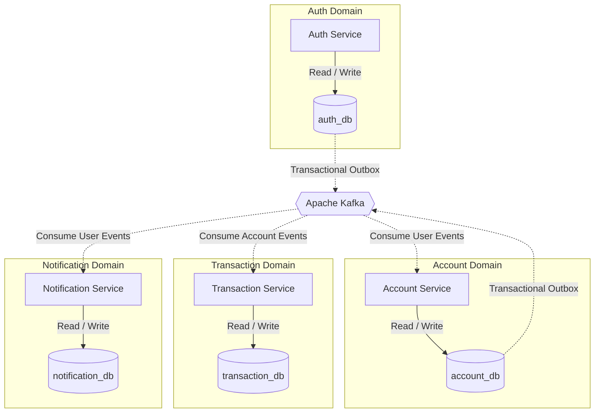
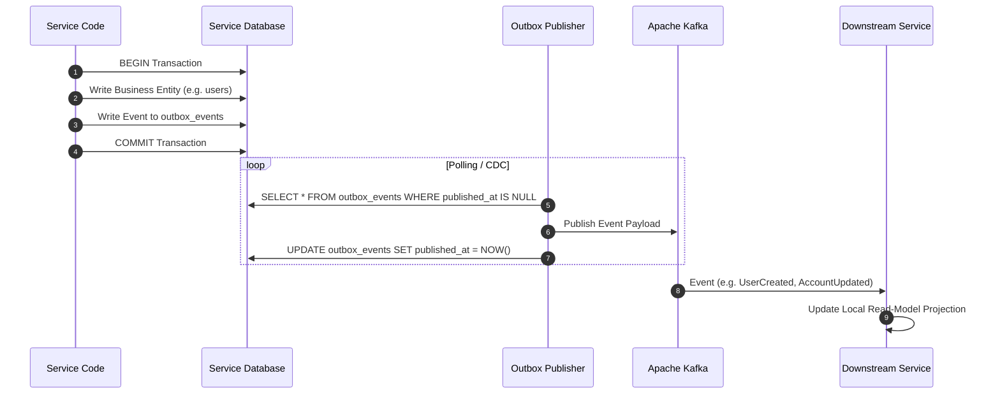
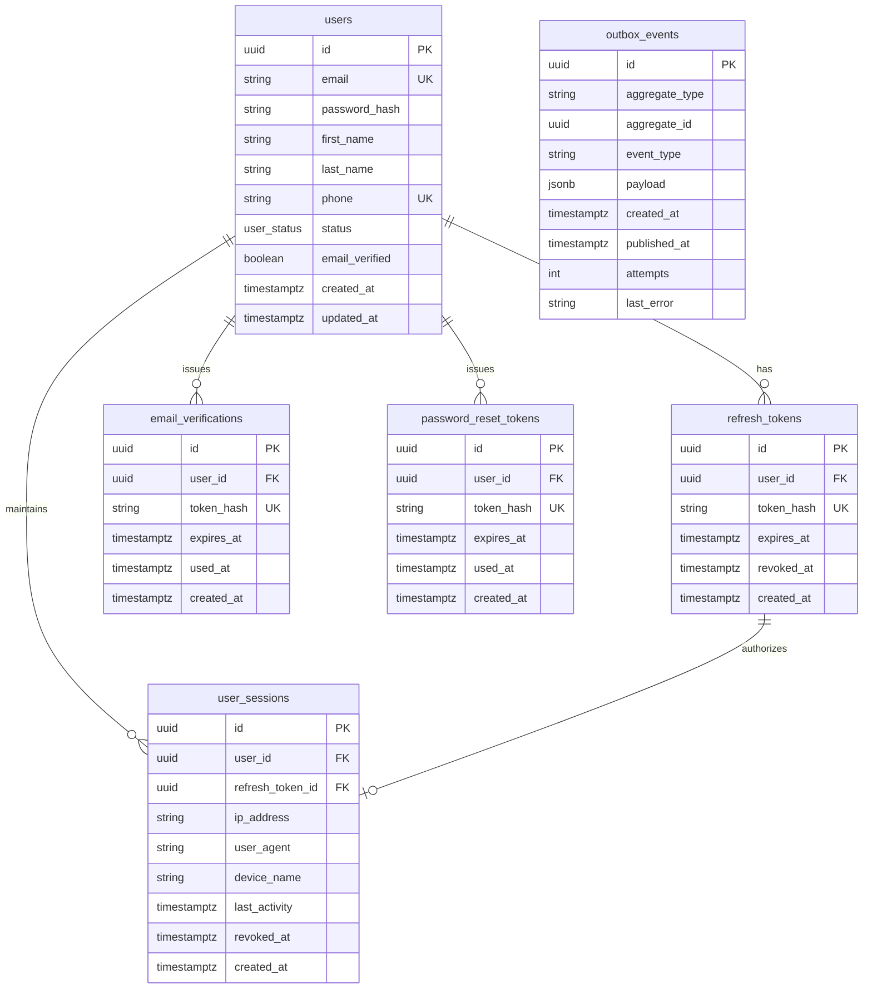
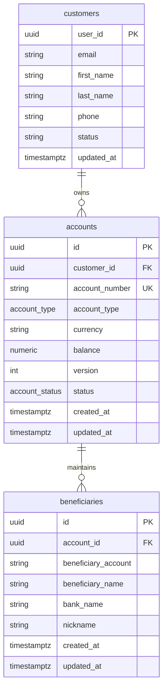
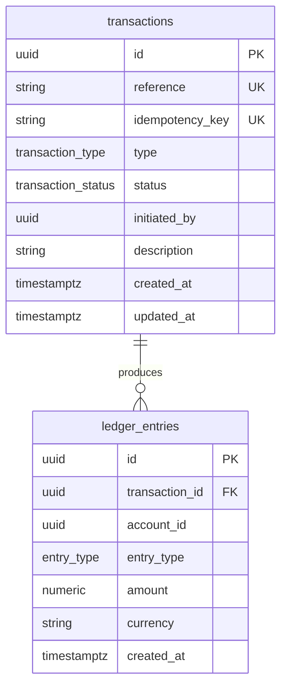
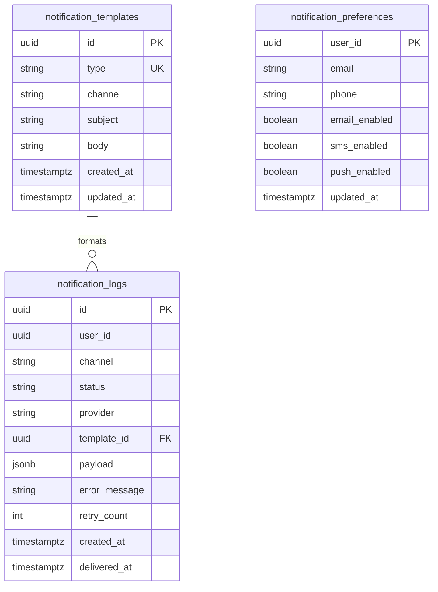

# 🏦 Enterprise Microservices Database Architecture

> **Architecture Style:** Database-per-Service Pattern  
> **Storage Engine:** PostgreSQL 16+  
> **Data Access Layer:** SQLC (Type-safe SQL) & gRPC  
> **Event Streaming:** Transactional Outbox + Apache Kafka

---

## 📋 Table of Contents

1. [Architectural Overview](#-architectural-overview)
2. [Data Replication & Synchronization](#-data-replication--synchronization)
3. [Auth Service Database (`auth_db`)](#-auth-service-database-auth_db)
4. [Account Service Database (`account_db`)](#-account-service-database-account_db)
5. [Transaction Service Database (`transaction_db`)](#-transaction-service-database-transaction_db)
6. [Notification Service Database (`notification_db`)](#-notification-service-database-notification_db)
7. [Core Design Principles](#-core-design-principles)
8. [Operational & Maintenance Matrix](#-operational--maintenance-matrix)

---

## 🏗️ Architectural Overview

Each microservice strictly owns its dedicated PostgreSQL database, enforcing clean domain boundaries and preventing cross-domain tight coupling. Direct cross-database queries or shared tables are strictly prohibited.

### Service-to-Database Mapping

| Service                  | Database Name     | Primary Domain Responsibility                                  |
| :----------------------- | :---------------- | :------------------------------------------------------------- |
| **Auth Service**         | `auth_db`         | User identity, credentials, sessions, tokens, and verification |
| **Account Service**      | `account_db`      | Bank accounts, customer projections, and beneficiaries         |
| **Transaction Service**  | `transaction_db`  | Financial transactions and double-entry ledger                 |
| **Notification Service** | `notification_db` | Preferences, message templates, and delivery logs              |

---

## 🔄 Data Replication & Synchronization

Data is replicated asynchronously between services using the **Transactional Outbox Pattern** paired with **Apache Kafka**. Dual-writes are strictly prohibited.

### Replication Matrix

| Producer            | Consumer                 | Event Types                                                | Replicated Fields / Projection                                      |
| :------------------ | :----------------------- | :--------------------------------------------------------- | :------------------------------------------------------------------ |
| **Auth Service**    | **Account Service**      | `UserCreated`, `UserUpdated`, `UserDeleted`                | `user_id`, `email`, `first_name`, `last_name`, `phone`, `status`    |
| **Auth Service**    | **Notification Service** | `UserCreated`, `UserUpdated`                               | `user_id`, `email`, `phone`                                         |
| **Account Service** | **Transaction Service**  | `AccountCreated`, `AccountUpdated`, `AccountStatusChanged` | `account_id`, `customer_id`, `account_number`, `currency`, `status` |

---

## 🔐 Auth Service Database (`auth_db`)

### Domain Scope

Handles authentication lifecycle, token management, security sessions, and transactional event publishing.

### Entity Relationship Diagram

### Table Definitions

#### `users`

Central user directory.

| Column           | Type           | Constraints                         | Description                             |
| :--------------- | :------------- | :---------------------------------- | :-------------------------------------- |
| `id`             | `UUID`         | **PK**, `DEFAULT gen_random_uuid()` | Primary Identifier                      |
| `email`          | `VARCHAR(255)` | **UNIQUE**, `NOT NULL`              | User primary email                      |
| `password_hash`  | `TEXT`         | `NOT NULL`                          | Argon2id / bcrypt password hash         |
| `first_name`     | `VARCHAR(100)` | `NOT NULL`                          | Given name                              |
| `last_name`      | `VARCHAR(100)` | `NOT NULL`                          | Family name                             |
| `phone`          | `VARCHAR(30)`  | **UNIQUE**                          | E.164 phone format                      |
| `status`         | `user_status`  | `NOT NULL`, `DEFAULT 'active'`      | State: `active`, `suspended`, `deleted` |
| `email_verified` | `BOOLEAN`      | `NOT NULL`, `DEFAULT FALSE`         | Email confirmation state                |
| `created_at`     | `TIMESTAMPTZ`  | `NOT NULL`, `DEFAULT now()`         | Account registration timestamp          |
| `updated_at`     | `TIMESTAMPTZ`  | `NOT NULL`, `DEFAULT now()`         | Last record update timestamp            |

> [!IMPORTANT]
> **Soft Delete Policy:** Users are soft-deleted by setting `status = 'deleted'`. Upon soft-deletion, all active `user_sessions` and `refresh_tokens` must be revoked immediately, and a `UserDeleted` event published.

**Custom Enums:**

- `user_status`: `'active'`, `'suspended'`, `'deleted'`

**Indexes:**

- `users_email_uq_idx` (Unique B-tree on `email`)
- `users_phone_uq_idx` (Unique B-tree on `phone` WHERE `phone IS NOT NULL`)
- `users_status_created_idx` (Compound B-tree on `(status, created_at)`)

---

#### `refresh_tokens`

Long-lived authentication tokens.

| Column       | Type          | Constraints                                          | Description                   |
| :----------- | :------------ | :--------------------------------------------------- | :---------------------------- |
| `id`         | `UUID`        | **PK**, `DEFAULT gen_random_uuid()`                  | Token ID                      |
| `user_id`    | `UUID`        | `NOT NULL`, **FK** → `users(id)` `ON DELETE CASCADE` | Associated user               |
| `token_hash` | `TEXT`        | **UNIQUE**, `NOT NULL`                               | Cryptographic hash of token   |
| `expires_at` | `TIMESTAMPTZ` | `NOT NULL`                                           | Token expiration date         |
| `revoked_at` | `TIMESTAMPTZ` | `NULLABLE`                                           | Explicit revocation timestamp |
| `created_at` | `TIMESTAMPTZ` | `NOT NULL`, `DEFAULT now()`                          | Issue timestamp               |

> [!SECURITY]
> **Security Rule:** Never store plain-text tokens. Store SHA-256 / HMAC hashes in `token_hash`.

**Indexes:**

- `refresh_tokens_hash_uq_idx` (Unique B-tree on `token_hash`)
- `refresh_tokens_user_idx` (B-tree on `user_id`)
- `refresh_tokens_active_idx` (Partial B-tree on `(user_id, expires_at)` WHERE `revoked_at IS NULL`)

---

#### `user_sessions`

Tracks active user devices and sessions.

| Column             | Type           | Constraints                                          | Description                       |
| :----------------- | :------------- | :--------------------------------------------------- | :-------------------------------- |
| `id`               | `UUID`         | **PK**, `DEFAULT gen_random_uuid()`                  | Session ID                        |
| `user_id`          | `UUID`         | `NOT NULL`, **FK** → `users(id)` `ON DELETE CASCADE` | Session owner                     |
| `refresh_token_id` | `UUID`         | **FK** → `refresh_tokens(id)` `ON DELETE SET NULL`   | Linked refresh token              |
| `ip_address`       | `VARCHAR(45)`  | `NULLABLE`                                           | Client IPv4 / IPv6 address        |
| `user_agent`       | `TEXT`         | `NULLABLE`                                           | Client User-Agent string          |
| `device_name`      | `VARCHAR(100)` | `NULLABLE`                                           | Display name of client device     |
| `last_activity`    | `TIMESTAMPTZ`  | `NOT NULL`, `DEFAULT now()`                          | Timestamp of last API interaction |
| `revoked_at`       | `TIMESTAMPTZ`  | `NULLABLE`                                           | Explicit session end timestamp    |
| `created_at`       | `TIMESTAMPTZ`  | `NOT NULL`, `DEFAULT now()`                          | Session creation timestamp        |

**Indexes:**

- `user_sessions_user_idx` (B-tree on `user_id`)
- `user_sessions_token_idx` (B-tree on `refresh_token_id`)
- `user_sessions_active_activity_idx` (Partial B-tree on `(user_id, last_activity DESC)` WHERE `revoked_at IS NULL`)

---

#### `email_verifications`

One-time email confirmation tokens.

| Column       | Type          | Constraints                                          | Description              |
| :----------- | :------------ | :--------------------------------------------------- | :----------------------- |
| `id`         | `UUID`        | **PK**, `DEFAULT gen_random_uuid()`                  | Token record ID          |
| `user_id`    | `UUID`        | `NOT NULL`, **FK** → `users(id)` `ON DELETE CASCADE` | Associated user          |
| `token_hash` | `TEXT`        | **UNIQUE**, `NOT NULL`                               | Cryptographic token hash |
| `expires_at` | `TIMESTAMPTZ` | `NOT NULL`                                           | Validity window          |
| `used_at`    | `TIMESTAMPTZ` | `NULLABLE`                                           | Consumption timestamp    |
| `created_at` | `TIMESTAMPTZ` | `NOT NULL`, `DEFAULT now()`                          | Issue timestamp          |

> [!NOTE]
> **Replay Prevention:** A token is valid if `used_at IS NULL AND expires_at > now()`. Set `used_at = now()` immediately upon consumption.

**Indexes:**

- `email_verifications_hash_idx` (Unique B-tree on `token_hash`)
- `email_verifications_user_idx` (B-tree on `user_id`)

---

#### `password_reset_tokens`

One-time password recovery tokens.

| Column       | Type          | Constraints                                          | Description              |
| :----------- | :------------ | :--------------------------------------------------- | :----------------------- |
| `id`         | `UUID`        | **PK**, `DEFAULT gen_random_uuid()`                  | Reset token ID           |
| `user_id`    | `UUID`        | `NOT NULL`, **FK** → `users(id)` `ON DELETE CASCADE` | Target user              |
| `token_hash` | `TEXT`        | **UNIQUE**, `NOT NULL`                               | Cryptographic token hash |
| `expires_at` | `TIMESTAMPTZ` | `NOT NULL`                                           | Expiration timestamp     |
| `used_at`    | `TIMESTAMPTZ` | `NULLABLE`                                           | Consumption timestamp    |
| `created_at` | `TIMESTAMPTZ` | `NOT NULL`, `DEFAULT now()`                          | Creation timestamp       |

**Indexes:**

- `password_reset_tokens_hash_idx` (Unique B-tree on `token_hash`)
- `password_reset_tokens_user_idx` (B-tree on `user_id`)

---

#### `outbox_events`

Transactional outbox table for out-of-process event streaming.

| Column           | Type           | Constraints                         | Description                      |
| :--------------- | :------------- | :---------------------------------- | :------------------------------- |
| `id`             | `UUID`         | **PK**, `DEFAULT gen_random_uuid()` | Unique event ID                  |
| `aggregate_type` | `VARCHAR(50)`  | `NOT NULL`                          | Domain entity name (e.g. `user`) |
| `aggregate_id`   | `UUID`         | `NOT NULL`                          | ID of modified entity            |
| `event_type`     | `VARCHAR(100)` | `NOT NULL`                          | Event name (e.g. `UserCreated`)  |
| `payload`        | `JSONB`        | `NOT NULL`                          | Serialized JSON event data       |
| `created_at`     | `TIMESTAMPTZ`  | `NOT NULL`, `DEFAULT now()`         | Outbox enqueue timestamp         |
| `published_at`   | `TIMESTAMPTZ`  | `NULLABLE`                          | Kafka dispatch timestamp         |
| `attempts`       | `INT`          | `NOT NULL`, `DEFAULT 0`             | Relay publish attempts count     |
| `last_error`     | `TEXT`         | `NULLABLE`                          | Relayer failure trace            |

**Indexes:**

- `outbox_events_unpublished_idx` (Partial B-tree on `(created_at)` WHERE `published_at IS NULL`)
- `outbox_events_aggregate_idx` (B-tree on `(aggregate_type, aggregate_id)`)
- `outbox_events_published_cleanup_idx` (B-tree on `published_at`)

---

## 🏦 Account Service Database (`account_db`)

### Domain Scope

Manages bank account balances, customer read-projections, and beneficiaries.

### Entity Relationship Diagram

### Table Definitions

#### `customers`

Read-only replica of user profiles published by Auth Service.

| Column       | Type           | Constraints                 | Description                     |
| :----------- | :------------- | :-------------------------- | :------------------------------ |
| `user_id`    | `UUID`         | **PK**                      | Maps to `users.id` in `auth_db` |
| `email`      | `VARCHAR(255)` | `NOT NULL`                  | Replicated email                |
| `first_name` | `VARCHAR(100)` | `NOT NULL`                  | Replicated first name           |
| `last_name`  | `VARCHAR(100)` | `NOT NULL`                  | Replicated last name            |
| `phone`      | `VARCHAR(30)`  | `NULLABLE`                  | Replicated phone number         |
| `status`     | `VARCHAR(20)`  | `NOT NULL`                  | Replicated user status          |
| `updated_at` | `TIMESTAMPTZ`  | `NOT NULL`, `DEFAULT now()` | Last sync update timestamp      |

> [!NOTE]
> **Read Model Projection:** Do not edit `customers` locally. All updates must originate from `Auth Service` via Kafka.

**Indexes:**

- `customers_email_idx` (B-tree on `email`)
- `customers_status_idx` (B-tree on `status`)

---

#### `accounts`

Core customer financial accounts.

| Column           | Type             | Constraints                               | Description                                     |
| :--------------- | :--------------- | :---------------------------------------- | :---------------------------------------------- |
| `id`             | `UUID`           | **PK**, `DEFAULT gen_random_uuid()`       | Account ID                                      |
| `customer_id`    | `UUID`           | `NOT NULL`, **FK** → `customers(user_id)` | Account owner                                   |
| `account_number` | `VARCHAR(30)`    | **UNIQUE**, `NOT NULL`                    | Human-readable account identifier               |
| `account_type`   | `account_type`   | `NOT NULL`                                | Account type: `savings`, `checking`, `business` |
| `currency`       | `CHAR(3)`        | `NOT NULL`                                | ISO-4217 Currency (e.g. `USD`, `EUR`)           |
| `balance`        | `NUMERIC(20,4)`  | `NOT NULL`, `DEFAULT 0`                   | Cached current balance                          |
| `version`        | `INT`            | `NOT NULL`, `DEFAULT 0`                   | Optimistic locking control                      |
| `status`         | `account_status` | `NOT NULL`, `DEFAULT 'active'`            | State: `active`, `frozen`, `closed`             |
| `created_at`     | `TIMESTAMPTZ`    | `NOT NULL`, `DEFAULT now()`               | Account opening timestamp                       |
| `updated_at`     | `TIMESTAMPTZ`    | `NOT NULL`, `DEFAULT now()`               | Last update timestamp                           |

> [!WARNING]
> **Balance Synchronization & Concurrency:**
>
> 1. `balance` is a **cached read-model** updated in lock-step with transactions. The double-entry ledger in `transaction_db` is the source of truth.
> 2. `version` must be incremented on balance updates to enforce optimistic locking (`WHERE version = :current_version`).

**Custom Enums:**

- `account_type`: `'savings'`, `'checking'`, `'business'`
- `account_status`: `'active'`, `'frozen'`, `'closed'`

**Indexes:**

- `accounts_num_uq_idx` (Unique B-tree on `account_number`)
- `accounts_customer_idx` (B-tree on `customer_id`)
- `accounts_status_cust_idx` (Compound B-tree on `(status, customer_id)`)

---

#### `beneficiaries`

Saved payout targets for transfers.

| Column                | Type           | Constraints                                             | Description              |
| :-------------------- | :------------- | :------------------------------------------------------ | :----------------------- |
| `id`                  | `UUID`         | **PK**, `DEFAULT gen_random_uuid()`                     | Beneficiary ID           |
| `account_id`          | `UUID`         | `NOT NULL`, **FK** → `accounts(id)` `ON DELETE CASCADE` | Source account           |
| `beneficiary_account` | `VARCHAR(30)`  | `NOT NULL`                                              | Target account number    |
| `beneficiary_name`    | `VARCHAR(150)` | `NOT NULL`                                              | Target owner legal name  |
| `bank_name`           | `VARCHAR(150)` | `NULLABLE`                                              | Routing / Receiving bank |
| `nickname`            | `VARCHAR(100)` | `NULLABLE`                                              | User display alias       |
| `created_at`          | `TIMESTAMPTZ`  | `NOT NULL`, `DEFAULT now()`                             | Creation timestamp       |
| `updated_at`          | `TIMESTAMPTZ`  | `NOT NULL`, `DEFAULT now()`                             | Update timestamp         |

**Indexes:**

- `beneficiaries_account_idx` (B-tree on `account_id`)
- `beneficiaries_account_target_uq_idx` (Unique B-tree on `(account_id, beneficiary_account)`)

---

#### `outbox_events`

Identical structure to Auth Service `outbox_events`. Publishes `AccountCreated`, `AccountUpdated`, and `AccountStatusChanged` events.

---

## 💸 Transaction Service Database (`transaction_db`)

### Domain Scope

High-performance, immutable double-entry financial ledger.

### Entity Relationship Diagram

### Table Definitions

#### `transactions`

Lifecycle record of financial requests.

| Column            | Type                 | Constraints                         | Description                                                        |
| :---------------- | :------------------- | :---------------------------------- | :----------------------------------------------------------------- |
| `id`              | `UUID`               | **PK**, `DEFAULT gen_random_uuid()` | Transaction ID                                                     |
| `reference`       | `VARCHAR(50)`        | **UNIQUE**, `NOT NULL`              | Business reference / Tracking code                                 |
| `idempotency_key` | `VARCHAR(64)`        | **UNIQUE**, `NOT NULL`              | Client idempotency key                                             |
| `type`            | `transaction_type`   | `NOT NULL`                          | Type: `deposit`, `withdrawal`, `transfer`                          |
| `status`          | `transaction_status` | `NOT NULL`, `DEFAULT 'pending'`     | State: `pending`, `processing`, `completed`, `failed`, `cancelled` |
| `initiated_by`    | `UUID`               | `NOT NULL`                          | User or System initiator ID                                        |
| `description`     | `TEXT`               | `NULLABLE`                          | Transfer narrative                                                 |
| `created_at`      | `TIMESTAMPTZ`        | `NOT NULL`, `DEFAULT now()`         | Initiation timestamp                                               |
| `updated_at`      | `TIMESTAMPTZ`        | `NOT NULL`, `DEFAULT now()`         | Status change timestamp                                            |

> [!TIP]
> **Idempotency Protection:** Perform an `UPSERT` or pre-check on `idempotency_key` to prevent duplicate billing during network retries.

**Custom Enums:**

- `transaction_type`: `'deposit'`, `'withdrawal'`, `'transfer'`
- `transaction_status`: `'pending'`, `'processing'`, `'completed'`, `'failed'`, `'cancelled'`

**Indexes:**

- `transactions_ref_uq_idx` (Unique B-tree on `reference`)
- `transactions_idem_uq_idx` (Unique B-tree on `idempotency_key`)
- `transactions_user_created_idx` (Compound B-tree on `(initiated_by, created_at DESC)`)
- `transactions_status_created_idx` (Compound B-tree on `(status, created_at)`)

---

#### `ledger_entries`

Immutable double-entry balance accounting log.

| Column           | Type            | Constraints                             | Description                  |
| :--------------- | :-------------- | :-------------------------------------- | :--------------------------- |
| `id`             | `UUID`          | **PK**, `DEFAULT gen_random_uuid()`     | Entry ID                     |
| `transaction_id` | `UUID`          | `NOT NULL`, **FK** → `transactions(id)` | Parent transaction           |
| `account_id`     | `UUID`          | `NOT NULL`                              | Target account               |
| `entry_type`     | `entry_type`    | `NOT NULL`                              | Direction: `debit`, `credit` |
| `amount`         | `NUMERIC(20,4)` | `NOT NULL`, `CHECK (amount > 0)`        | Positive monetary value      |
| `currency`       | `CHAR(3)`       | `NOT NULL`                              | ISO-4217 Currency            |
| `created_at`     | `TIMESTAMPTZ`   | `NOT NULL`, `DEFAULT now()`             | Post timestamp               |

> [!CAUTION]
> **Double-Entry Accounting Standard:**  
> Every single financial operation MUST generate matching debit and credit entries such that:  
> $$\sum \text{Debits} - \sum \text{Credits} = 0$$
> Ledger entries are **strictly append-only**. Updates or deletes are prohibited. Use reversal entries for adjustments.

**Custom Enums:**

- `entry_type`: `'debit'`, `'credit'`

**Indexes:**

- `ledger_tx_idx` (B-tree on `transaction_id`)
- `ledger_account_stmt_idx` (Compound B-tree on `(account_id, created_at DESC)`)
- `ledger_account_curr_idx` (Compound B-tree on `(account_id, currency, created_at)`)

---

## 🔔 Notification Service Database (`notification_db`)

### Domain Scope

Manages customer communication preferences, notification templates, and dispatch logs.

### Entity Relationship Diagram

### Table Definitions

#### `notification_preferences`

Customer delivery settings (replicated profile + settings).

| Column          | Type           | Constraints                 | Description                    |
| :-------------- | :------------- | :-------------------------- | :----------------------------- |
| `user_id`       | `UUID`         | **PK**                      | User ID                        |
| `email`         | `VARCHAR(255)` | `NOT NULL`                  | Recipient email address        |
| `phone`         | `VARCHAR(30)`  | `NULLABLE`                  | Recipient phone number         |
| `email_enabled` | `BOOLEAN`      | `NOT NULL`, `DEFAULT TRUE`  | Email opt-in state             |
| `sms_enabled`   | `BOOLEAN`      | `NOT NULL`, `DEFAULT TRUE`  | SMS opt-in state               |
| `push_enabled`  | `BOOLEAN`      | `NOT NULL`, `DEFAULT TRUE`  | Push notification opt-in state |
| `updated_at`    | `TIMESTAMPTZ`  | `NOT NULL`, `DEFAULT now()` | Last sync/update timestamp     |

---

#### `notification_templates`

Message layout templates.

| Column       | Type           | Constraints                         | Description                              |
| :----------- | :------------- | :---------------------------------- | :--------------------------------------- |
| `id`         | `UUID`         | **PK**, `DEFAULT gen_random_uuid()` | Template ID                              |
| `type`       | `VARCHAR(50)`  | **UNIQUE**, `NOT NULL`              | Template code (e.g. `WELCOME_EMAIL`)     |
| `channel`    | `VARCHAR(20)`  | `NOT NULL`                          | Delivery channel: `email`, `sms`, `push` |
| `subject`    | `VARCHAR(255)` | `NULLABLE`                          | Subject line (email/push)                |
| `body`       | `TEXT`         | `NOT NULL`                          | Template text with dynamic placeholders  |
| `created_at` | `TIMESTAMPTZ`  | `NOT NULL`, `DEFAULT now()`         | Creation timestamp                       |
| `updated_at` | `TIMESTAMPTZ`  | `NOT NULL`, `DEFAULT now()`         | Update timestamp                         |

---

#### `notification_logs`

Historical outbound dispatch logs.

| Column          | Type           | Constraints                           | Description                              |
| :-------------- | :------------- | :------------------------------------ | :--------------------------------------- |
| `id`            | `UUID`         | **PK**, `DEFAULT gen_random_uuid()`   | Log ID                                   |
| `user_id`       | `UUID`         | `NOT NULL`                            | Recipient user ID                        |
| `channel`       | `VARCHAR(20)`  | `NOT NULL`                            | Channel used (`email`, `sms`, `push`)    |
| `status`        | `VARCHAR(30)`  | `NOT NULL`                            | Status: `queued`, `sent`, `failed`       |
| `provider`      | `VARCHAR(100)` | `NULLABLE`                            | Gateway used (e.g. `SendGrid`, `Twilio`) |
| `template_id`   | `UUID`         | **FK** → `notification_templates(id)` | Rendered template reference              |
| `payload`       | `JSONB`        | `NULLABLE`                            | Dynamic context parameter map            |
| `error_message` | `TEXT`         | `NULLABLE`                            | Delivery failure error string            |
| `retry_count`   | `INT`          | `NOT NULL`, `DEFAULT 0`               | Retries executed                         |
| `created_at`    | `TIMESTAMPTZ`  | `NOT NULL`, `DEFAULT now()`           | Request timestamp                        |
| `delivered_at`  | `TIMESTAMPTZ`  | `NULLABLE`                            | Confirmation timestamp                   |

**Indexes:**

- `notification_logs_user_recent_idx` (Compound B-tree on `(user_id, created_at DESC)`)
- `notification_logs_status_retry_idx` (Compound B-tree on `(status, created_at)`)
- `notification_logs_template_idx` (B-tree on `template_id`)

---

## 🏛️ Core Design Principles

| Principle                  | Technical Implementation                                                               |
| :------------------------- | :------------------------------------------------------------------------------------- |
| **Database per Service**   | Strict physical and logical database isolation per domain service.                     |
| **Single Source of Truth** | Service owning the database is the sole writer. Projections are read-only.             |
| **Transactional Outbox**   | Atomically append business changes + outbox event in the same DB transaction.          |
| **Idempotent Operations**  | Enforce unique constraints on `idempotency_key` to ignore duplicated client requests.  |
| **Optimistic Concurrency** | Use explicit `version` numbers on financial accounts to prevent race conditions.       |
| **Auditability & Lineage** | Append-only ledger accounting with strict debit-credit balancing.                      |
| **At-Rest Security**       | One-way hashing (`Argon2id` / `SHA-256`) for passwords, tokens, and sensitive secrets. |

---

## 🛠️ Operational & Maintenance Matrix

| Concern                | Target Table(s)                         | Operational Strategy / Recommendation                                                                                               |
| :--------------------- | :-------------------------------------- | :---------------------------------------------------------------------------------------------------------------------------------- |
| **High Write Volume**  | `ledger_entries` `notification_logs` | Provision **monthly range partitioning** on `created_at` to ensure fast index scans and facilitate drop-partition archiving.        |
| **Outbox Pruning**     | `outbox_events`                         | Deploy a scheduled cron worker to purge or move records to cold storage where `published_at < NOW() - INTERVAL '7 days'`.           |
| **Ledger Integrity**   | `accounts` `ledger_entries`          | Run an automated daily reconciliation script comparing `accounts.balance` against `SUM(credit) - SUM(debit)` from `ledger_entries`. |
| **Cross-Currency**     | `ledger_entries`                        | Cross-currency operations require a middle FX rate service + suspense/clearing account ledger entries before clearing balance.      |
| **PII & Compliance**   | `outbox_events`                         | Redact sensitive PII fields in `payload` JSONB prior to writing to the outbox table to comply with GDPR/banking standards.          |
| **Token Invalidation** | `users` `user_sessions`              | Trigger cascade session revocation upon `users.status = 'deleted'` or password reset.                                               |

---
